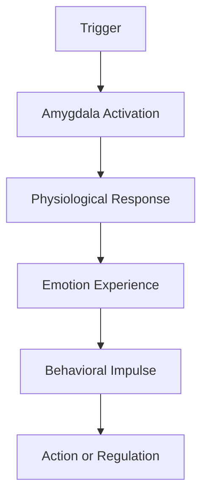

---
tags:
  - mastery
  - emotion
  - "#todo"
---
## 1. Introduction

**[[Emotional Intelligence Quotient|Emotional Intelligence (EI)]]** is the capacity to recognize, understand, manage, and influence emotions—both your own and those of others. Originally popularized by Daniel Goleman in the 1990s, EI has become a critical factor in personal effectiveness and workplace success.

> "In a very real sense we have two minds, one that thinks and one that feels." 
> – _Daniel Goleman_

### Components of Emotional Intelligence
While models vary, most EI frameworks revolve around these core domains:

- **Self-awareness** – Knowing your emotions, strengths, and limits
- **Self-regulation** – Managing your emotions and impulses
- **Motivation** – Being driven to achieve beyond expectations
- **Empathy** – Understanding others' emotions
- **Social skills** – Managing relationships to move people in desired directions

### Why Emotional Intelligence Matters at Work
EI directly influences:
- Communication and collaboration
- Conflict resolution and negotiation
- Leadership and decision-making
- Psychological safety and trust
- Stress management and resilience

Organizations that foster emotional intelligence:
- Enjoy higher team performance
- Have stronger employee engagement
- Navigate change more effectively
- Reduce burnout and turnover

### Evolution of EI in the Workplace
* 1983: Howard Gardner introduces multiple intelligences, including interpersonal and intrapersonal intelligence
* 1990: Salovey & Mayer define Emotional Intelligence formally
* 1995: Daniel Goleman's Emotional Intelligence book becomes a global phenomenon
* 2000s–Present: Neuroscience research supports EI principles; companies integrate EI into hiring, training, and leadership development

| Trait                  | Description                                   | Stability                          |
| ---------------------- | --------------------------------------------- | ---------------------------------- |
| Personality            | Enduring traits like openness or extraversion | Moderately stable                  |
| Emotional Intelligence | Learnable skills for emotional competence     | Trainable and improvable over time |
## 2. The Science of Emotions

### What Are Emotions?

Emotions are short-lived but intense reactions to stimuli, involving physiological changes, thoughts, and behavioral urges. They serve evolutionary purposes by helping us react quickly to important situations.

> We are not thinking machines that feel, but feeling machines that think. 
> – Antonio Damasio

### Key Characteristics
* Emotions are universal and biologically based
* They arise in response to internal or external triggers
* They involve automatic physiological and neurological responses
* They occur rapidly and influence attention and memory

### Functions of Emotions
* **Survival:** Fight-or-flight responses
* **Social bonding:** Expressing emotions builds connections
* **Decision-making:** Emotions influence judgments and actions
* **Learning:** Emotional events are more memorable

### Emotions vs Moods vs Traits

| Type    | Duration        | Triggered by       | Example                           |
| ------- | --------------- | ------------------ | --------------------------------- |
| Emotion | Seconds/minutes | Specific situation | Feeling angry after an insult     |
| Mood    | Hours/days      | No clear trigger   | Feeling low all day               |
| Trait   | Lifelong        | Disposition        | Being a naturally cheerful person |
### The Emotional Brain: Basic Pathway

### Theories of Emotion
* **James-Lange**: Emotions result from our interpretation of bodily reactions
* **Cannon-Bard**: Emotions and physical reactions occur simultaneously
* **Schachter-Singer** (Two-Factor): Emotion = Arousal + Cognitive Label
* **Appraisal Theory** (Lazarus, 1991): Emotions depend on how we interpret events

### Universal Emotions
Psychologist Paul Ekman identified 7 universal facial expressions:
* Happiness
* Sadness
* Anger
* Fear
* Disgust
* Surprise
* Contempt
These are recognized across cultures and linked to specific facial muscle activations.

### Emotional Memory & Learning
The brain remembers emotionally charged events more vividly (amygdala-hippocampus interaction)
Emotionally salient experiences shape future emotional responses

Understanding emotions sets the foundation for building emotional intelligence.