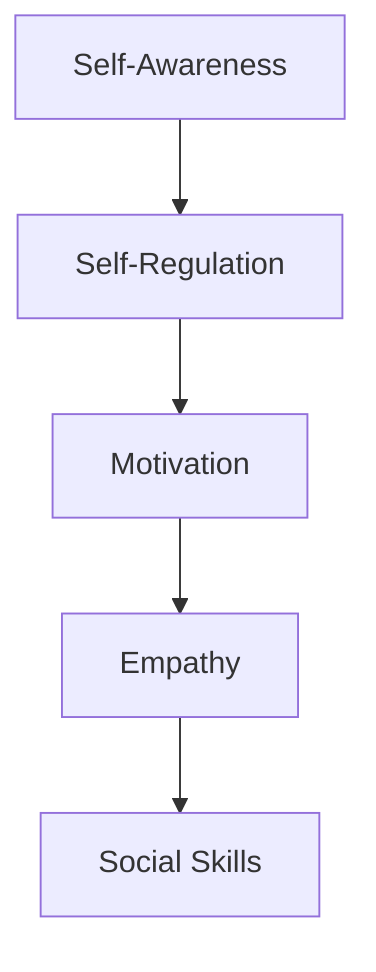
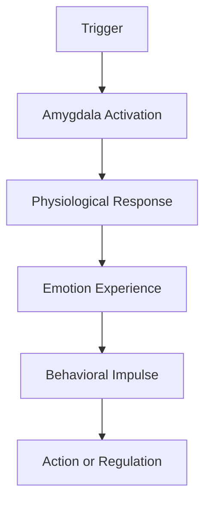
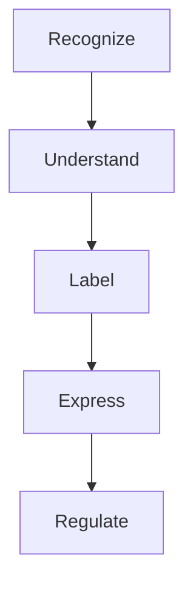
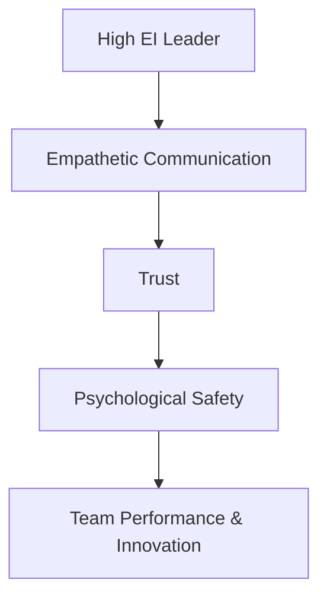
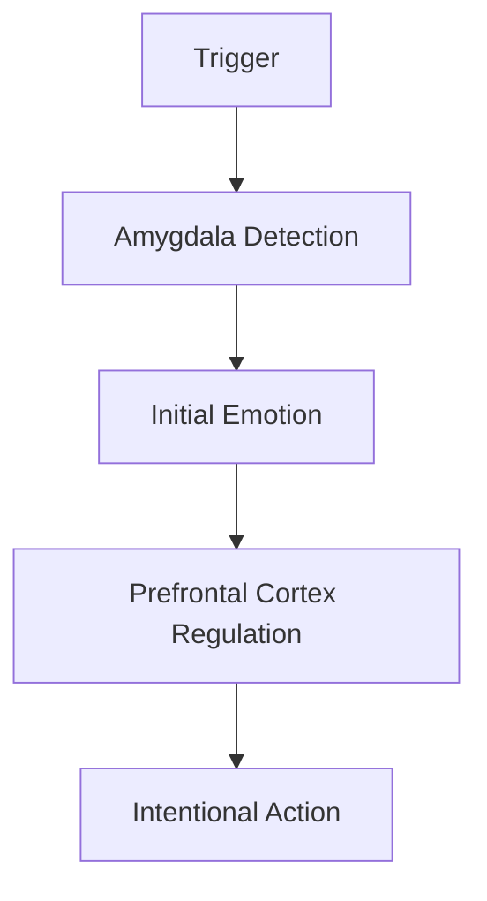
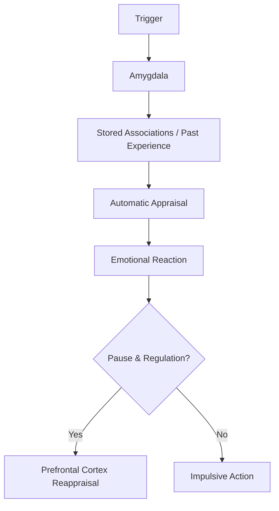
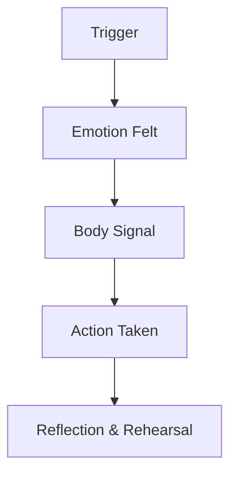

---
tags:
  - mastery
  - emotion
  - "#todo"
---
## 1. Introduction

**[[Emotional Intelligence Quotient|Emotional Intelligence (EI)]]** is the capacity to recognize, understand, manage, and influence emotions—both your own and those of others. Originally popularized by Daniel Goleman in the 1990s, EI has become a critical factor in personal effectiveness and workplace success.

> "In a very real sense we have two minds, one that thinks and one that feels." 
> – _Daniel Goleman_

### Components of Emotional Intelligence
While models vary, most EI frameworks revolve around these core domains:

- **Self-awareness** – Knowing your emotions, strengths, and limits
- **Self-regulation** – Managing your emotions and impulses
- **Motivation** – Being driven to achieve beyond expectations
- **Empathy** – Understanding others' emotions
- **Social skills** – Managing relationships to move people in desired directions

Each of these domains builds on the previous. For example, you can’t regulate what you don’t recognize (awareness), and empathy often requires self-regulation to avoid emotional contagion.

### Why Emotional Intelligence Matters at Work

EI directly influences:
- Communication and collaboration
- Conflict resolution and negotiation
- Leadership and decision-making
- Psychological safety and trust
- Stress management and resilience

Organizations that foster emotional intelligence:
- Enjoy higher team performance
- Have stronger employee engagement
- Navigate change more effectively
- Reduce burnout and turnover

### Evolution of EI in the Workplace
* 1983: Howard Gardner introduces multiple intelligences, including interpersonal and intrapersonal intelligence
* 1990: Salovey & Mayer define Emotional Intelligence formally
* 1995: Daniel Goleman's Emotional Intelligence book becomes a global phenomenon
* 2000s–Present: Neuroscience research supports EI principles; companies integrate EI into hiring, training, and leadership development

| Trait                  | Description                                   | Stability                          |
| ---------------------- | --------------------------------------------- | ---------------------------------- |
| Personality            | Enduring traits like openness or extraversion | Moderately stable                  |
| Emotional Intelligence | Learnable skills for emotional competence     | Trainable and improvable over time |
## 2. The Science of Emotions

### What Are Emotions?

Emotions are short-lived but intense reactions to stimuli, involving physiological changes, thoughts, and behavioral urges. They serve evolutionary purposes by helping us react quickly to important situations.

> We are not thinking machines that feel, but feeling machines that think. 
> – Antonio Damasio

### Key Characteristics
* Emotions are universal and biologically based
* They arise in response to internal or external triggers
* They involve automatic physiological and neurological responses
* They occur rapidly and influence attention and memory

### Functions of Emotions
* **Survival:** Fight-or-flight responses
* **Social bonding:** Expressing emotions builds connections
* **Decision-making:** Emotions influence judgments and actions
* **Learning:** Emotional events are more memorable

### Emotions vs Moods vs Traits

| Type    | Duration        | Triggered by       | Example                           |
| ------- | --------------- | ------------------ | --------------------------------- |
| Emotion | Seconds/minutes | Specific situation | Feeling angry after an insult     |
| Mood    | Hours/days      | No clear trigger   | Feeling low all day               |
| Trait   | Lifelong        | Disposition        | Being a naturally cheerful person |
### The Emotional Brain: Basic Pathway

### Theories of Emotion
* **James-Lange**: Emotions result from our interpretation of bodily reactions
* **Cannon-Bard**: Emotions and physical reactions occur simultaneously
* **Schachter-Singer** (Two-Factor): Emotion = Arousal + Cognitive Label
* **Appraisal Theory** (Lazarus, 1991): Emotions depend on how we interpret events

### Universal Emotions

Psychologist Paul Ekman identified 7 universal facial expressions:

* Happiness
* Sadness
* Anger
* Fear
* Disgust
* Surprise
* Contempt
These are recognized across cultures and linked to specific facial muscle activations.

### Emotional Memory & Learning

- The brain remembers emotionally charged events more vividly ([[amygdala-hippocampus interaction]])
- Emotionally salient experiences shape future emotional responses

Understanding emotions sets the foundation for building emotional intelligence.

## 3. Other Frameworks

### Brackett's RULER Model

Developed at Yale Center for Emotional Intelligence, the RULER model is a framework for developing emotional intelligence skills:

R: **Recognizing** emotions in self and others
U: **Understanding** the causes and consequences of emotions
L: **Labeling** emotions with a nuanced vocabulary
E: **Expressing** emotions appropriately in different contexts
R: **Regulating** emotions effectively to promote growth

The RULER approach emphasizes that EI is not just about recognizing emotions, but also about skillfully using them to enhance learning, relationships, and decision-making.

## Psychological Safety and Trust
Emotional Intelligence enables [[psychological safety]] by:
- Fostering empathy and perspective-taking
- Helping leaders self-regulate their responses to feedback or failure
- Promoting non-defensive communication
- Encouraging emotionally aware conflict resolution

### How to Foster Psychological Safety

- Model vulnerability (e.g. admit your mistakes as a leader)
- Encourage curiosity and asking questions
- React constructively to feedback and dissent
- Explicitly invite alternative views
- Reward learning over blame

## Neuroscience of Emotional Intelligence
### The Emotional Brain
Your emotional responses are not random. They are rooted in the brain's architecture. Understanding how emotions are processed neurologically empowers us to manage them more effectively.

Key Brain Regions Involved in EI

| Region            | Function                                                                    |
| ----------------- | --------------------------------------------------------------------------- |
| Amygdala          | Detects threats, triggers emotional reactions (especially fear, anger)      |
| Prefrontal Cortex | Regulates emotional responses, responsible for planning and decision-making |
| Insula            | Facilitates emotional awareness, empathy, and bodily sensations             |
| Hippocampus       | Stores emotional memories and connects them with context                    |

### Building EI Through Brain Training
- **Mindfulness meditation** enhances emotional awareness and focus
- **Journaling** engages the prefrontal cortex and builds self-reflection
- **Cognitive reappraisal** (rethinking situations) rewires response patterns
- **Gratitude practices** activate brain regions linked to empathy and bonding

### Brain Pathway for Emotionally Intelligent Response

## 7. Triggers and Emotional Regulation
### What Are Emotional Triggers?
Emotional triggers are events, interactions, or thoughts that provoke a strong emotional reaction—often without conscious intention. They are learned through past experiences and stored in the brain's emotional memory system.

### Types of Triggers

- **External**: Criticism, loud noises, social rejection
- **Internal**: Memories, negative self-talk, physical discomfort
- **Relational**: Authority figures, perceived disrespect, vulnerability
### The Trigger Process

## Recognizing Your Triggers
Awareness is the first step. Reflect on:
- What situations regularly provoke strong reactions?
- What themes do these triggers share (e.g., control, respect, failure)?
- Are there common physical signals (e.g., racing heart, clenched jaw)?
### The Regulation Toolkit
Once you recognize a trigger, these tools help regulate your response:

1. Name It to Tame It
	Labeling emotions reduces their intensity and engages your rational brain.
	"I feel overwhelmed" instead of "Everything is falling apart"
2. Cognitive Reappraisal
	Reframe how you view the situation:
	"This is a chance to learn" vs. "I messed up again"
3. Breath & Pause
	Even a short pause gives the prefrontal cortex time to intervene.
	Try box breathing: Inhale–Hold–Exhale–Hold (4 seconds each)
4. Body Awareness
	Emotions live in the body. Notice and release tension.
	- Stretching
	- Grounding exercises
	- Walking or movement
5. Rehearse Your Response
	Mentally practice handling triggering moments calmly. Visualization creates new neural pathways.

### Exercise: Trigger Reflection Map

1. Identify a recent triggering situation
2. Fill in the following:
    - **Trigger**: What sparked it?
    - **Initial Emotion**: What did I feel?
    - **Physical Cues**: What did I notice in my body?
    - **Reaction**: What did I do?
    - **Alternative Response**: What could I do next time?

## 8. Bias and Attentional Awareness
### Why Attention Matters in EI
Your attention is your gateway to emotional understanding. If you aren’t aware of what you or others are feeling in the moment, it’s impossible to respond with emotional intelligence. Yet attention is often limited, distracted, or biased.
### Common Attention Failures
- **In-attentional Blindness**: Failing to notice visible but unexpected things
- **Change Blindness**: Missing changes in a visual scene or behavior
- **Tunnel Vision**: Focusing too narrowly on one emotional cue or task

**Example**: You might miss a colleague’s distress signals because you're hyper-focused on your own stress or a deadline.

### Key Cognitive Biases that Affect EI

1. **Confirmation Bias**: Tendency to focus on info that confirms existing beliefs
2. **Fundamental Attribution Error**: Overemphasizing personality over situation when judging others

Self-Serving Bias

Attributing your success to self, but failure to external causes

Me-Theory Bias

Assuming others feel or think the same way you do

Halo Effect

Letting one positive trait influence all judgments

Othello Error

Mistaking fear or stress as signs of guilt